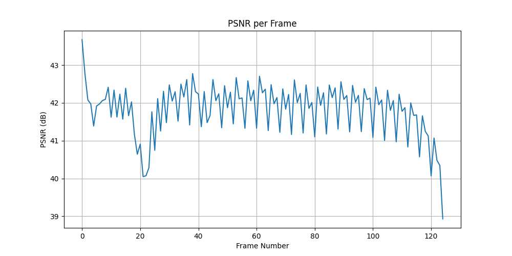

[](https://classroom.github.com/a/SdXSjEmH)

# EV-HW3: PhysGaussian

## Homework Specification

This homework is based on the recent CVPR 2024 paper [PhysGaussian](https://github.com/XPandora/PhysGaussian/tree/main), which introduces a novel framework that integrates physical constraints into 3D Gaussian representations for modeling generative dynamics.

You are **not required** to implement training from scratch. Instead, your task is to set up the environment as specified in the official repository and run the simulation scripts to observe and analyze the results.

### Getting the Code from the Official PhysGaussian GitHub Repository

Download the official codebase using the following command:

```
git clone https://github.com/XPandora/PhysGaussian.git
```

### Environment Setup

Navigate to the "PhysGaussian" directory and follow the instructions under the "Python Environment" section in the official README to set up the environment.

### Running the Simulation

Follow the "Quick Start" section and execute the simulation scripts as instructed. Make sure to verify your outputs and understand the role of physics constraints in the generated dynamics.

### Homework Instructions

Please complete Part 1–2 as described in the [Google Slides](https://docs.google.com/presentation/d/13JcQC12pI8Wb9ZuaVV400HVZr9eUeZvf7gB7Le8FRV4/edit?usp=sharing).

## My Answer (Results)

I used the offical PhysGaussian repository on CSIE workstation Meow1 to run the simulation. However, I encountered some issues with the environment setup, the way I solved the issues is described in the following sections. The results of the simulation are also included below.

### Environment Setup (on Meow1)

As the CUDA version on Meow1 is 12.8 which is not the desired version for the PhysGaussian repository, I modified the codebase to make it compatible with the newer version (e.g. include corresponding C libraries, increase memory limits, etc.). I made the necessary changes to the codebase and made a patch file for easy usage. In that case, after recursively cloning the repository, one can directly apply the changes of submodules by:

```bash
patch -p1 < changes.patch
```

After that, I use `venv` to create a virtual environment using the `requirement.txt` I provided and the version of Python is 3.9.23.

Finally, install the PhysGaussian repository as a package in the virtual environment as the official repository suggests:

```bash
cd PhysGaussian
pip install -e .
```

And hopefully, you can run the simulation scripts without any issues on the Meow1 workstation.

### Part 1: Baseline Simulation

In this part, I simulated three different materials with default parameters as a baseline, as required by the assignment. The result is shown below:

- `sand`:
  - Baseline Parameter Settings:

    | Parameter | Value |
    |:----------|:---------------------|
    | `material` | `sand` |
    | `n_grid` | 100 |
    | `substep_dt` | 1e-4 |
    | `grid_v_damping_scale` | 0.9999 |
    | `softening` | 0.1 |

    **Note:** For the details of other parameters, please refer to the file I provided in `config/baseline/custom_sand_sim.json`. The `n_grid` is larger than other materials, which is because the sand material requires a higher resolution to simulate the details of the sand particles.

  - Simulation Video: [Link to the video](https://youtube.com/shorts/2JhbbjYjp6c?feature=share)

    
  - Brief Description:
        `sand` is a granular medium. Instead of a single solid object, it behaves as a collection of individual particles. Upon impact, the sand does not bounce as a whole but instead flows and disperses, with particles scattering and settling into a pile. This demonstrates the characteristic behavior of granular materials.
- `metal`:
  - Parameters:

    | Parameter | Value |
    |:----------|:---------------------|
    | `material` | `metal` |
    | `n_grid` | 25 |
    | `substep_dt` | 1e-4 |
    | `grid_v_damping_scale` | 0.9999 |
    | `softening` | 0.1 |

    **Note:** For the details of other parameters, please refer to the file I provided in `config/baseline/custom_metal_sim.json`.
  - Simulation Video: [Link to the video](https://youtube.com/shorts/hDyMcZAmI74?feature=share)

    
  - Brief Description:
        `metal` behaves as an elastoplastic solid. Under small impacts, it is elastic, meaning it resists bending and springs back to its original shape. However, if subjected to a very strong force, it will exceed its elastic limit and undergo plastic deformation, causing it to bend permanently and not return to its original form. In this `ficus` simulation, as I don't provide a `yield_stress` parameter, it defaults to be 0, which means the metal will start to deform plastically under any impact, resulting in a permanent bend.
- `plasticine`:
  - Parameters:

    | Parameter | Value |
    |:----------|:---------------------|
    | `material` | `plasticine` |
    | `n_grid` | 25 |
    | `substep_dt` | 1e-4 |
    | `grid_v_damping_scale` | 0.9999 |
    | `softening` | 0.1 |

    **Note:** For the details of other parameters, please refer to the file I provided in `config/baseline/custom_plasticine_sim.json`.
  - Simulation Video: [Link to the video](https://youtube.com/shorts/iPZ-AKoJf8w?feature=share)

    
  - Brief Description: This is an extra one. I only ran the simulation with `sand` and `metal` materials, but I noticed that only the `plasticine` material be used for `softening` parameter. However, after running the simulation, I found that the `plasticine` material behaves to be a very bouncy material, which is not the expected behavior. I think this is because the young's modulus (`E`), which is shared by all materials I used, is set to a very high value (2e6). With such a high value, the `plasticine` material behaves more like a solid than a soft material. I think this is not the expected behavior of the `plasticine` material.

The default values of the parameters are mostly from `ficus_config.json` in the official repository, except for the parameters that are listed above. And all the simulation videos are run with the original `gs_simlation.py` with the `ficus_whitebg-trained` model:

```bash
python gs_simulation.py --model_path model/ficus_whitebg-trained/ --output_path <output_path> --config ../config/<config_path> --render_img --compile_video
```

---

### Part 2: Exploring MPM Parameter Effects

This section details the results of an ablation study on the key physical parameters in the simulation. The study is organized by parameter to analyze its effect across different materials.

PSNR curves (PSNR vs frame number) are used to evaluate the difference between the baseline and adjusted parameters. It is computed with my own implementation of PSNR, you can run it as follows:

```bash
python calc_psnr.py --baseline <baseline_video> --target <target_video> --output_curve_path <output_curve_path>
```

#### 1. Adjusting `n_grid`

This study explores the effect of the MPM grid resolution (`n_grid`).

- **Material:** `sand` (decreased from 100 to 50)
  - **PSNR:** 29.05

    
  - **Simulation Video:** [Link to video](https://youtube.com/shorts/pRCkLeAwtV4?feature=share)
- **Material:** `metal` (increased from 25 to 50)
  - **PSNR:** 17.01

    
  - **Simulation Video:** [Link to video](https://youtube.com/shorts/hDyMcZAmI74?feature=share)
- **Material:** `plasticine` (increased from 25 to 50)
  - **PSNR:** 22.08

    
  - **Simulation Video:** [Link to video](https://youtube.com/shorts/UkUaPRoWHSk?feature=share)

##### Visual Comparison for `n_grid`

| Material    | Baseline (`n_grid`: default)                 | Adjusted (`n_grid`: 50)                      |
| :---------- | :-------------------------------------------: | :-------------------------------------------: |
| **Sand** |  |  |
| **Metal** |  |  |
| **Plasticine** |  |  |

**Important Notes:** The baseline `n_grid` value is 100 for `sand`, and 25 for both `metal` and `plasticine`. The adjusted value is set to 50 for all materials. Hence, the adjusted `n_grid` is not always lower or higher than the baseline, but rather a comparative value to analyze the effect of grid resolution.

#### Overall Observations & Insights for `n_grid`

The `n_grid` parameter, which defines the resolution of the underlying simulation grid, has a profound impact on both the visual quality and the physical plausibility of the simulations. A higher `n_grid` value makes the simulation process more sensitive to fine-grained interactions, resulting in motion that appears more natural and detailed.

Conversely, a lower `n_grid` value leads to a more coarse simulation, which can result in artifacts such as jittery motion or unrealistic interactions between particles if we see the `sand` simulation really closely. But `sand` simulation is still acceptable, as `n_grid = 50` is still a relatively high resolution for the sand material, and it means a lot for the `sand` material as it is a granular medium that requires a higher resolution to simulate the details of the sand particles, that's why I set the baseline `n_grid` to be 100. However, for the `metal` and `plasticine` materials, a lower `n_grid` value is sufficient to capture the essential dynamics without introducing significant artifacts, as they are more solid-like materials. Also, as the state of the `metal` and `plasticine` materials are more stable and less prone to fine-grained interactions, the PSNR values for these materials are going to be stable, too.

---

#### 2. Adjusting `substep_dt`

This study explores the effect of the simulation time step size (`substep_dt`).

- **Material:** `sand`
  - **PSNR:** 15.52

    
  - **Simulation Video:** [Link to video](https://youtube.com/shorts/TjX9gdCpIvY?feature=share)
- **Material:** `metal`
  - **PSNR:** 18.35

    
  - **Simulation Video:** [Link to video](https://youtube.com/shorts/apv-FjOMsZQ?feature=share)
- **Material:** `plasticine`
  - **PSNR:** 22.64

    
  - **Simulation Video:** [Link to video](https://youtube.com/shorts/UkUaPRoWHSk?feature=share)

##### Visual Comparison for `substep_dt`

| Material    | Baseline (`substep_dt`: default)                 | Adjusted (`substep_dt`: 1e-5)                      |
| :---------- | :-------------------------------------------: | :-------------------------------------------: |
| **Sand** |  |  |
| **Metal** |  |  |
| **Plasticine** |  |  |

##### Overall Observations & Insights for `substep_dt`

The `substep_dt` parameter directly controls the temporal resolution of the physics simulation, and its adjustment presents a classic trade-off between computational cost and simulation fidelity. In this study, I reduced the `substep_dt` from the default value of 1e-4 to 1e-5, effectively increasing the number of physics calculations per frame by a factor of 10.

The most immediate difference is that the running time of the script is significantly longer, as reducing substep_dt by a factor of 10 means ten times more physics calculations are performed for each rendered frame. However, the results clearly show that with a smaller time step, the performance improves, leading to a more stable and physically accurate simulation. This "careful" simulation is better able to handle rapid changes in motion, such as the initial impact and subsequent rebound or dispersion.

And the PSNR values are increasing after the state of the material is stable, which means even the simulation process is a bit difference, the final state of the material is still similar to the baseline simulation.

---

#### 3. Adjusting `grid_v_damping_scale`

This study explores the effect of the grid velocity damping factor (`grid_v_damping_scale`).

- **Material:** `sand`
  - **PSNR:** 15.33

    
  - **Simulation Video:** [Link to video](https://youtube.com/shorts/MOIi2vrwgAA?feature=share)
- **Material:** `metal`
  - **PSNR:** 17.67

    
  - **Simulation Video:** [Link to video](https://youtube.com/shorts/Vt2kfQB-NG8?feature=share)
- **Material:** `plasticine`
  - **PSNR:** 29.77

    
  - **Simulation Video:** [Link to video](https://youtube.com/shorts/mFf3deCnkcA?feature=share)

##### Visual Comparison for `grid_v_damping_scale`

| Material    | Baseline (`grid_v_damping_scale`: default)                 | Adjusted (`grid_v_damping_scale`: 0.95)                      |
| :---------- | :-------------------------------------------: | :-------------------------------------------: |
| **Sand** |  |  |
| **Metal** |  |  |
| **Plasticine** |  |  |

##### Overall Observations & Insights for `grid_v_damping_scale`

The grid_v_damping_scale parameter governs the rate of energy dissipation within the simulation grid. By setting this value to 0.9995—which is less than the default of 0.9999—we reduce the amount of damping, allowing objects to retain more kinetic energy.

This effect is most obvious in the `metal` simulation, where the lower damping results in a more energetic and higher-rebound collision. For the `sand`, the particles scatter more widely and take a noticeably longer time to settle, as less energy is lost during their interactions. The impact on the `plasticine` is the most subtle; since `plasticine` is designed to absorb energy and deform, there is very little kinetic energy to be preserved, so the change in damping has a minimal visual effect on its behavior. This highlights how damping primarily influences the elastic and dynamic properties of materials.

---

#### 4. Adjusting `softening`

This study explores the effect of the stress softening factor (`softening`).

- **Material:** `sand`
  - **PSNR:** 31.93

    
  - **Simulation Video:** [Link to video](https://youtube.com/shorts/3DcBmdQ2S40?feature=share)
- **Material:** `metal`
  - **PSNR:** 38.52

    
  - **Simulation Video:** [Link to video](https://youtube.com/shorts/H9I1ZmHY5hw?feature=share)
- **Material:** `plasticine`
  - **PSNR:** 41.81

    
  - **Simulation Video:** [Link to video](https://youtube.com/shorts/KQwwl2Oxij8?feature=share)

##### Visual Comparison for `softening`

| Material    | Baseline (`softening`: default)                 | Adjusted (`softening`: 0.3)                      |
| :---------- | :-------------------------------------------: | :-------------------------------------------: |
| **Sand** |  |  |
| **Metal** |  |  |
| **Plasticine** |  |  |

##### Overall Observations & Insights for `softening`

In my experiments, I found that the `softening` parameter doesn't seem to have any significant effect on the simulation results. I am curious about the reason behind this, as I expected it to influence the material's response to stress and deformation. After tracking the code, I found that the `softening` parameter is used in a function called `von_mises_return_mapping_with_damage`, which is only used in the `plasticine` material simulation. In the `sand` and `metal` materials, the `softening` parameter is not used at all, which explains why I didn't observe any changes in the simulation results when adjusting it.

That's why I ran the third simulation with the `plasticine` material. However, I still didn't observe any significant changes in the simulation results. After a careful review of the code, I found that the young's modulus (`E`) is set to a very high value (2e6) in the `plasticine` material, which means that the material is very stiff and doesn't deform much under stress. As a result, the `softening` parameter doesn't have a noticeable effect on the simulation results.

---

### BONUS: Automatic Parameter Inference

To automatically infer material parameters from a target video, we can design a framework that treats this as an optimization problem. As suggested in the PhysGaussian paper, a powerful and efficient approach would combine Gaussian Splatting (GS) segmentation with a differentiable Material Point Method (MPM) simulator.

The proposed framework would operate as follows:

1. **Scene Segmentation from Target Video:** Given a target video of a real-world object (or multiple objects), the first step is to use a **GS segmentation** technique. This process would analyze the video and identify distinct objects, assigning a unique label to the set of Gaussians that represent each object. This is crucial for scenes with multiple materials, as it allows us to optimize parameters for each object independently.

2. **Differentiable Physics Simulation:** The core of the framework is a **differentiable MPM simulator**. Unlike a standard simulator, a differentiable version allows us to analytically compute the gradient of the simulation's outcome with respect to the input physical parameters (e.g., Young's modulus, softening).

3. **Optimization Loop:** The system would then enter an iterative loop to find the best parameters using a gradient-based optimization method, which is a classic approach in optimization problems.

4. **Convergence:** The optimization is repeated until the loss converges to a minimum. At this point, the simulation video should closely match the target video, and the resulting set of parameters will be the inferred physical properties of the material(s).

This state-of-the-art "analysis-by-synthesis" approach is more efficient than black-box methods, as it uses gradient information to intelligently search for the optimal parameters rather than relying on random guessing.

---

## Reference

```bibtex
@inproceedings{xie2024physgaussian,
    title     = {Physgaussian: Physics-integrated 3d gaussians for generative dynamics},
    author    = {Xie, Tianyi and Zong, Zeshun and Qiu, Yuxing and Li, Xuan and Feng, Yutao and Yang, Yin and Jiang, Chenfanfu},
    booktitle = {Proceedings of the IEEE/CVF Conference on Computer Vision and Pattern Recognition},
    year      = {2024}
}
```
